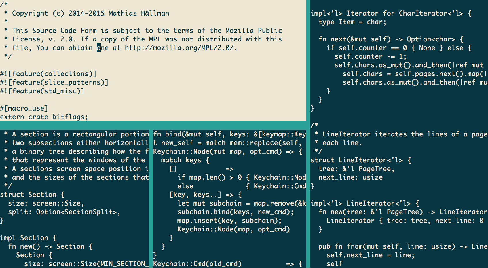

# Rim
Rim is an aspiring Vim-like text editor written in Rust.

## Current state
Rim is in an early prototype stage. This means that you can load, edit and save files, and hopefully do so relatively comfortably if Vim is what you are used to. In particular some of the simpler commands for insertion and deletion as well as window and buffer navigation has been implemented and bound to the expected key strokes.

## Try it out

For now you will need a nightly build of the Rust compiler in order to build Rim. When that is set up, simply clone and `cargo run`.

Note: Some key bindings are for testing purposes only, and some may not work exactly as you would expect them to.

Window navigation
- `<C-w>v/<C-w>s` - Split focused window
- `<C-w>c` - Close focused window
- `<C-w> h/j/k/l` - Move window focus left/down/up/right
- `n/N` - Move window focus forward/backward in window order
- `(<C->) y/u` - Resize focused window
- `<C-w>=` - Reset window sizes

Buffer navigation
- `h/j/k/l/Arrow keys` - Move caret
- `Home/0` - Move caret to start of line
- `End/$` - Move caret to end of line
- `PageUp/<C-b>` - Scroll view up by window's length
- `PageDown/<C-f>` - Scroll view down by window's length
- `<C-u>` - Scroll view up by half of window's length
- `<C-d>` - Scroll view down by half of window's length
- `gg` - Go to first line
- `G` - Go to last line
- `Space` in normal mode - move caret forward across line boundaries
- `Backspace` in normal mode - move caret backward across line boundaries

Insertion
- `i` - Enter insert mode
- `I` - Enter insert mode at start of line
- `a` - Enter insert mode after caret
- `A` - Enter insert mode at end of line
- `o` - Enter insert mode at a new line under the current line
- `O` - Enter insert mode at a new line above the current line
- `Escape` - Exit insert mode

Deletion
- `dd` - Delete line
- `D` - Delete rest of line
- `C` - Delete rest of line and enter insert mode
- `x` - Delete character under the cursor
- `X` - Delete character behind the cursor
- `r` - Replace character under the cursor
- `R` - Replace character on the line

Misc
- `q` - Quit
- `F1-F4` - Load some buffers
- `<C-w><C-w>` - Write buffer to file

## What's next?
Lots! But first maybe the ability to search in a buffer, which would open up for a range of other features.. or perhaps that big scary one; scripting

## Trouble shooting
As stated above, Rim requires Rust nightly to build. This is because Rim is using unstable features of the Rust language and standard libraries. Although breaking changes seem far between these days, it may be that I haven't updated to the latest nightly if things are not compiling for you.
